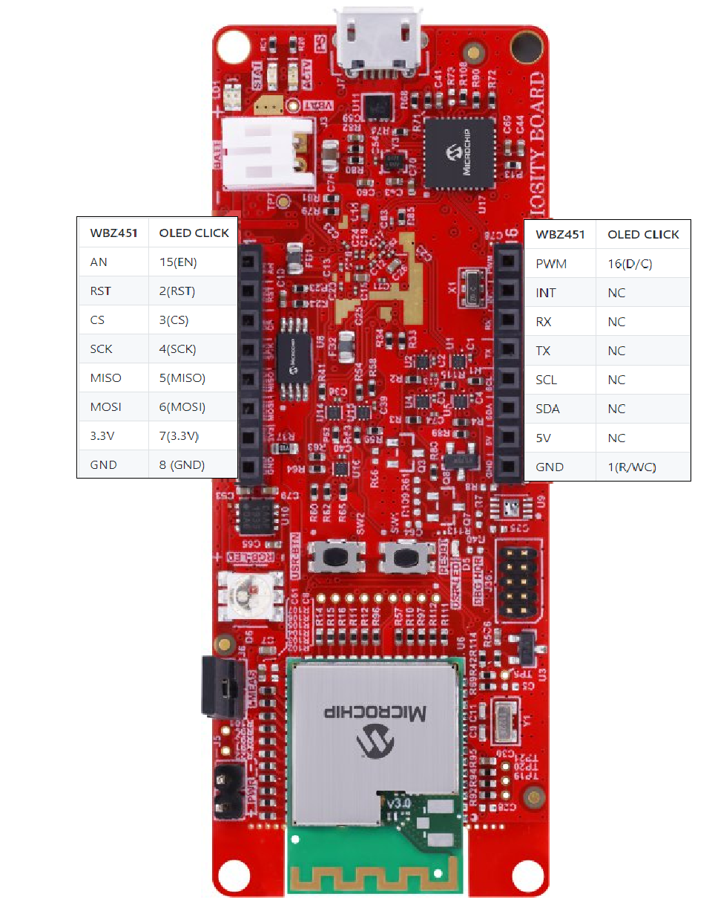
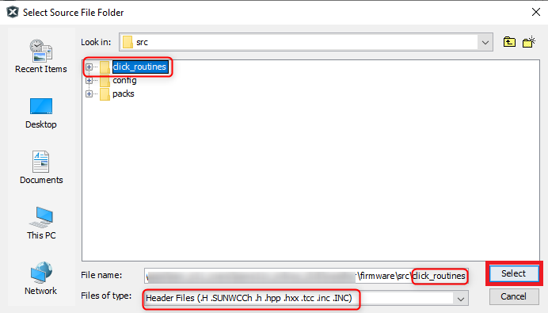
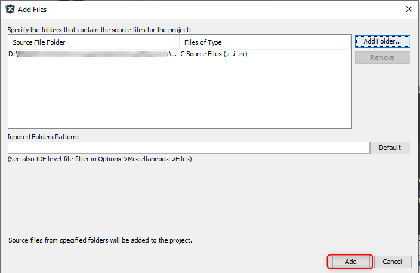
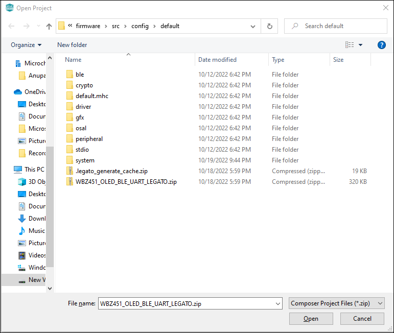
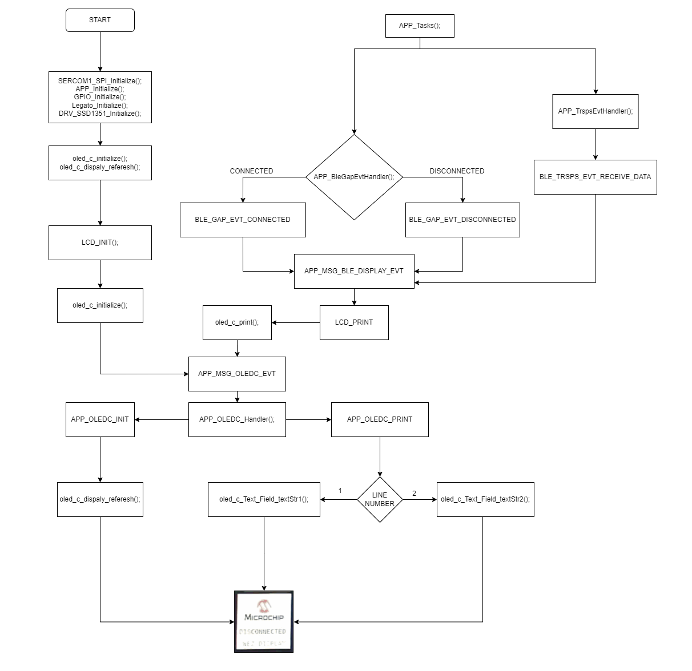

# WBZ45x BLE UART WITH OLED DISPLAY


> "IOT Made Easy!" 

Devices: **| PIC32CXBZ2 | WBZ45x |**<br>
Features: **| BLE | OLED |**


## ⚠ Disclaimer

<p><span style="color:red"><b>
THE SOFTWARE ARE PROVIDED "AS IS" AND GIVE A PATH FOR SELF-SUPPORT AND SELF-MAINTENANCE. This repository contains example code intended to help accelerate client product development. </br>

For additional Microchip repos, see: <a href="https://github.com/Microchip-MPLAB-Harmony" target="_blank">https://github.com/Microchip-MPLAB-Harmony</a>

Checkout the <a href="https://microchipsupport.force.com/s/" target="_blank">Technical support portal</a> to access our knowledge base, community forums or submit support ticket requests.
</span></p></b>

## Contents

1. [Introduction](#step1)
1. [Bill of materials](#step2)
1. [Hardware Setup](#step3)
1. [Software Setup](#step4)
1. [Harmony MCC Configuration](#step5)
1. [Board Programming](#step6)
1. [Run the demo](#step7)

## 1. Introduction<a name="step1">

This application demonstrates the use of an OLED Display interfaced with WBZ451 Curiosity Board using Serial Pheripheral Interface (SPI) protocol. WBZ451 Curiosity board receives data from Microchip Bluetooth Data [(MBD)](https://play.google.com/store/apps/details?id=com.microchip.bluetooth.data&hl=en_IN&gl=US) application through Bluetooth Low Energy (BLE) using [TRANSPARENT BLE UART](https://github.com/Microchip-MPLAB-Harmony/wireless_apps_pic32cxbz2_wbz45/tree/master/apps/ble/building_blocks/peripheral/profiles_services/peripheral_trp_uart) and sends the received data to OLED via SPI.


OLED C click features the PSP27801 OLED display, with the resolution of 96x96 pixels. The graphics driver used on this OLED display is the SSD1351, the display driver IC from Solomon Systech with embedded 128x128x18 bit SRAM display buffer. The SSD1351 driver is designed to work with the common cathode type OLED displays. 

## 2. Bill of materials<a name="step2">

- [PIC32CX-BZ2 and WBZ451 Curiosity Development Board](https://www.microchip.com/en-us/development-tool/EV96B94A)
- [OLED C CLICK](https://www.mikroe.com/oled-c-click)

## 3. Hardware Setup<a name="step3">

- Connect the OLED C CLICK with the WBZ451 CURIOSITY BOARD using the below table.


|     WBZ451    |OLED CLICK | Description |     WBZ451    |OLED CLICK | Description |
| :- | :- | :- | :- |:- | :- |
|     AN        |    15(EN) |    ENABLE   |    PWM        |    16(D/C)|     Data/Command   |
|     RST       |    2(RST) |    RESET    |    INT        |    NC     |     NC      |
|     CS        |    3(CS)  | CHIP SELECT |    RX         |    NC     |     NC      |
|     SCK       |    4(SCK) |    SPI CLOCK   |    TX         |    NC     |     NC      |
|     MISO      |    5(MISO)|    SERIAL DATA OUTPUT     |    SCL        |    NC     |     NC      |
|     MOSI      |    6(MOSI)|    SERIAL DATA INPUT     |    SDA        |    NC     |     NC      |
|     3.3V      |    7(3.3V)|    POWER SUPPLY      |    5V         |    NC     |     NC      |
|     GND       |    8 (GND)|    GROUND      |    GND        |    1(R/WC)|     Read/Write    |

| Note: PIN 1 of OLED should be connected with GND & PIN 15 of OLED should be connected with AN of WBZ451 respectively!! |
| --- |

 

## 4. Software Setup<a name="step4">

- [MPLAB X IDE ](https://www.microchip.com/en-us/tools-resources/develop/mplab-x-ide#tabs)

    - Version: 6.00
	- XC32 Compiler v4.10
	- MPLAB® Code Configurator v5.1.17
	- PIC32CX-BZ_DFP v1.0.107
	- MCC Harmony
	  - csp version: v3.13.1
	  - core version: v3.11.1
	  - CMSIS-FreeRTOS: v10.4.6
	  - wireless_pic32cxbz_wbz: v1.0.0
	  - wireless_ble: v1.0.0	  
	  - dev_packs: v3.13.1
	  - gfx: v3.11.1
	  - wolfssl version: v4.7.0
	  - crypto version: v3.7.6
	    
- Any Serial Terminal application like [TERA TERM](https://download.cnet.com/Tera-Term/3000-2094_4-75766675.html) terminal application

- [Microchip Bluetooth Data (MBD) iOS/Android app](https://play.google.com/store/apps/details?id=com.microchip.bluetooth.data&hl=en_IN&gl=US)

- [MPLAB X IPE v6.00](https://microchipdeveloper.com/ipe:installation)

## 5. Harmony MCC Configuration<a name="step5">

### Getting started with OLED DISPLAY with WBZ451 CURIOSITY BOARD.

| Tip | New users of MPLAB Code Configurator are recommended to go through the [overview](https://onlinedocs.microchip.com/pr/GUID-1F7007B8-9A46-4D03-AEED-650357BA760D-en-US-6/index.html?GUID-AFAB9227-B10C-4FAE-9785-98474664B50A) |
| :- | :- |

**Step 1** - Connect the WBZ451 CURIOSITY BOARD to the device/system using a micro-USB cable.

**Step 2** - The project graph of the OLED application is shown below.


**Step 3** - In MCC harmony project graph, select system and configure as mentioned below.

 

**Step 4** - In MCC harmony project graph, select FreeRTOS and configure as mentioned below.


**Step 5** - In MCC harmony project graph, select Core and configure as mentioned below.


**Step 6** - In MCC harmony project graph, select GFX Core LE and configure as mentioned below.


**Step 7** - In MCC harmony project graph select the SERCOM1 from device resources->peripherals and configure as shown below.


**Step 8** - In MCC harmony project graph, select SPI and configure as mentioned below.


**Step 9** - In MCC harmony project graph, select LE External Controller and configure as mentioned below.

 

**Step 10** - In MCC harmony project graph, select Legato and configure as mentioned below.


**Step 11** - In MCC harmony project graph select the SERCOM0 from device resources->peripherals and configure as shown below.


**Step 12** - In MCC harmony project graph select the BLE Stack from device resources->wireless->drivers->BLE and configure as shown below.

 


**Step 13** - In MCC harmony project graph, select wolfCrypt Library and configure as mentioned below.


**Step 14** - In MCC harmony project graph select the transparent profile from device resources->wireless->drivers->BLE->Profiles and configure as shown below.


**Step 15** - In project graph, go to Plugins->Pin configurations->Pin settings and set the pin configuration as shown below.


**Step 16** - From the unzipped folder copy the folder click_routines(which contains the oled_c.h & oled_c.c) to the folder firmware/src under your MPLAB Harmony v3 application project.

**Step 17** - Add the Header (oled_c.h) and Source file (oled_c.c).

- In the project explorer, Right click on folder Header Files and add a sub folder click_routines by selecting “Add Existing Items from Folders…”


- Click on “Add Folder…” button.


- Select the “click_routines” folder and select “Files of Types” as Header Files.



- Click on “Add” button to add the selected folder.


- The OLED C lick header files gets added to your project.


- In the project explorer, Right click on folder Source Files and add a sub folder click_routines by selecting “Add Existing Items from Folders…”.


- Click on “Add Folder…” button


- Select the “click_routines” folder and select “Files of Types” as Source Files.


- Click on “Add” button to add the selected folder



- The OLED C Click source files gets added to your project.


- The click_routines folder contain an C source file oled_c.c. You could use oled_c.c as a reference to add OLED C display functionality to your application.

**Step 18** - Design Graphics on Legato Graphics Composer.

- From the Cloned folder copy "WBZ451_OLED_BLE_UART_LEGATO.zip" file to the folder firmware\src\config\default under your MPLAB Harmony v3 application project.

- Open Legato graphics composer from MCC Plugin.




- Design graphics using MPLAB Harmony “Legato Graphics Composer”. Launch it using “Project Graph > Plugins > Legato Graphics Composer”.


- Use Object Editor to edit the configuration for Input Widgets and Dispaly Widgets


- The Legato Graphics Composer for the "WBZ451_OLED_BLE_UART_LEGATO.zip" OLED Application is shown below.


**Step 19** - Change the following Code as givien below.

- In your MPLAB Harmony v3 based application go to "firmware\src\app_user_edits.c", make sure the below code line is commented.

  - "#error User action required - manually edit files as described here".

- In your MPLAB Harmony v3 based application go to "firmware\src\config\default\peripheral\sercom\spi_master\plib_sercom1_spi_master.c" and do the following changes.
  
  - At Line 177 include the following code to setup the clock frequency.  
```
	if (setup->clockFrequency == 0)
		{
			baudValue = SERCOM1_SPIM_BAUD_VALUE;
		}
		else
		{
			baudValue = (spiSourceClock/(2U*(setup->clockFrequency))) - 1U;
		}
```			


- In your MPLAB Harmony v3 based application go to "firmware\src\config\default\gfx\legato\generated\le_gen_harmony.c" and do the following changes.

  - Comment the following lines.

    - Line 29: 	
	```
	//#include "system/input/sys_input.h"
	```
    - Line 32: 	
	```
	//SYS_INP_InputListener inputListener;
	```
    - Line 34: 	
	```
	//static void touchDownHandler(const SYS_INP_TouchStateEvent* const evt);
    ```
	- Line 35: 	
	```
	//static void touchUpHandler(const SYS_INP_TouchStateEvent* const evt);
    ```
	- Line 36: 	
	```
	//static void touchMoveHandler(const SYS_INP_TouchMoveEvent* const evt);
	```
	- Line 58: 	
	```
	//inputListener.handleTouchDown = &touchDownHandler;
	```
	- Line 59: 	
	```
	//inputListener.handleTouchUp = &touchUpHandler;
	```
	- Line 60: 	
	```
	//inputListener.handleTouchMove = &touchMoveHandler;
	```
	- Line 71: 	
	```
	//SYS_INP_AddListener(&inputListener);
	```
	
  - Line 95 to 108: Comment the following lines.
  
	```
	//void touchDownHandler(const SYS_INP_TouchStateEvent* const evt)
	//{
		//leInput_InjectTouchDown(evt->index, evt->x, evt->y);
	//}
	//void touchUpHandler(const SYS_INP_TouchStateEvent* const evt)
	//{
		//leInput_InjectTouchUp(evt->index, evt->x, evt->y);
	//}
	//void touchMoveHandler(const SYS_INP_TouchMoveEvent* const evt)
	//{
		//leInput_InjectTouchMoved(evt->index, evt->x, evt->y);
	//}
	```

- In your MPLAB Harmony v3 based application go to "firmware\src\app.h" and do the following changes.

	- Add the line "APP_MSG_DISPLAY_EVT" & "APP_MSG_OLEDC_EVT" as shown below.
	
```
APP_MSG_BLE_DISPLAY_EVT,
APP_MSG_OLEDC_EVT,
```


- In your MPLAB Harmony v3 based application go to "firmware\src\app.c" and do the following changes.

	- Copy & Paste the following Code.
	
```
// DOM-IGNORE-BEGIN
/*******************************************************************************
* Copyright (C) 2022 Microchip Technology Inc. and its subsidiaries.
*
* Subject to your compliance with these terms, you may use Microchip software
* and any derivatives exclusively with Microchip products. It is your
* responsibility to comply with third party license terms applicable to your
* use of third party software (including open source software) that may
* accompany Microchip software.
*
* THIS SOFTWARE IS SUPPLIED BY MICROCHIP "AS IS". NO WARRANTIES, WHETHER
* EXPRESS, IMPLIED OR STATUTORY, APPLY TO THIS SOFTWARE, INCLUDING ANY IMPLIED
* WARRANTIES OF NON-INFRINGEMENT, MERCHANTABILITY, AND FITNESS FOR A
* PARTICULAR PURPOSE.
*
* IN NO EVENT WILL MICROCHIP BE LIABLE FOR ANY INDIRECT, SPECIAL, PUNITIVE,
* INCIDENTAL OR CONSEQUENTIAL LOSS, DAMAGE, COST OR EXPENSE OF ANY KIND
* WHATSOEVER RELATED TO THE SOFTWARE, HOWEVER CAUSED, EVEN IF MICROCHIP HAS
* BEEN ADVISED OF THE POSSIBILITY OR THE DAMAGES ARE FORESEEABLE. TO THE
* FULLEST EXTENT ALLOWED BY LAW, MICROCHIP'S TOTAL LIABILITY ON ALL CLAIMS IN
* ANY WAY RELATED TO THIS SOFTWARE WILL NOT EXCEED THE AMOUNT OF FEES, IF ANY,
* THAT YOU HAVE PAID DIRECTLY TO MICROCHIP FOR THIS SOFTWARE.
*******************************************************************************/
// DOM-IGNORE-END

/*******************************************************************************
  MPLAB Harmony Application Source File

  Company:
    Microchip Technology Inc.

  File Name:
    app.c

  Summary:
    This file contains the source code for the MPLAB Harmony application.

  Description:
    This file contains the source code for the MPLAB Harmony application.  It
    implements the logic of the application's state machine and it may call
    API routines of other MPLAB Harmony modules in the system, such as drivers,
    system services, and middleware.  However, it does not call any of the
    system interfaces (such as the "Initialize" and "Tasks" functions) of any of
    the modules in the system or make any assumptions about when those functions
    are called.  That is the responsibility of the configuration-specific system
    files.
 *******************************************************************************/

// *****************************************************************************
// *****************************************************************************
// Section: Included Files
// *****************************************************************************
// *****************************************************************************
#include <string.h>
#include "app.h"
#include "definitions.h"
#include "app_ble.h"
#include "click_routines/oled_c/oled_c.h"
#include "ble_trsps/ble_trsps.h"
#include <stdio.h>
#include <stdlib.h>
#include <math.h>
#include "system/console/sys_console.h"
#include "configuration.h"
#include "osal/osal.h"

SYS_CONSOLE_HANDLE readConsoleHandle;
SYS_CONSOLE_HANDLE writeConsoleHandle;

uint16_t conn_hdl = 0xFFFF;
// *****************************************************************************
// *****************************************************************************
// Section: Global Data Definitions
// *****************************************************************************
// *****************************************************************************

// *****************************************************************************
/* Application Data

  Summary:
    Holds application data

  Description:
    This structure holds the application's data.

  Remarks:
    This structure should be initialized by the APP_Initialize function.

    Application strings and buffers are be defined outside this structure.
*/

APP_DATA appData;

// *****************************************************************************
// *****************************************************************************
// Section: Application Callback Functions
// *****************************************************************************
// *****************************************************************************

/* TODO:  Add any necessary callback functions.
*/

// *****************************************************************************
// *****************************************************************************
// Section: Application Local Functions
// *****************************************************************************
// *****************************************************************************


/* TODO:  Add any necessary local functions.
*/


// *****************************************************************************
// *****************************************************************************
// Section: Application Initialization and State Machine Functions
// *****************************************************************************
// *****************************************************************************

/*******************************************************************************
  Function:
    void APP_Initialize ( void )

  Remarks:
    See prototype in app.h.
 */

void APP_Initialize ( void )
{
    /* Place the App state machine in its initial state. */
    appData.state = APP_STATE_INIT;
    
    appData.appQueue = xQueueCreate( 64, sizeof(APP_Msg_T) );
    /* TODO: Initialize your application's state machine and other
     * parameters.
     */
}


/******************************************************************************
  Function:
    void APP_Tasks ( void )

  Remarks:
    See prototype in app.h.
 */
void APP_Tasks ( void )
{
    APP_Msg_T    appMsg[1];
    APP_Msg_T   *p_appMsg;
    p_appMsg=appMsg;

    /* Check the application's current state. */
    switch ( appData.state )
    {
        /* Application's initial state. */
        case APP_STATE_INIT:
        {
            bool appInitialized = true;
            //appData.appQueue = xQueueCreate( 10, sizeof(APP_Msg_T) );
            APP_BleStackInit();
            RTC_Timer32Start();
            BLE_GAP_SetAdvEnable(0x01, 0);
            SERCOM0_USART_Write((uint8_t *)"WBZ451_OLED_BLE_UART\r\n",24);
            writeConsoleHandle=SYS_CONSOLE_HandleGet(SYS_CONSOLE_INDEX_0);
            
            if (appInitialized)
            {
                appData.state = APP_STATE_LCD_INIT;
            }
            break;
        }
        
        case APP_STATE_LCD_INIT:
        {
            LCD_INIT();
            appData.state = APP_STATE_SERVICE_TASKS;            
            break;
        }

        case APP_STATE_SERVICE_TASKS:
        {
            if (OSAL_QUEUE_Receive(&appData.appQueue, &appMsg, OSAL_WAIT_FOREVER))
            {
                if(p_appMsg->msgId==APP_MSG_BLE_STACK_EVT)
                {
                    // Pass BLE Stack Event Message to User Application for handling
                    APP_BleStackEvtHandler((STACK_Event_T *)p_appMsg->msgData);
                }
                if(p_appMsg->msgId==APP_MSG_BLE_STACK_LOG)
                {
                    // Pass BLE LOG Event Message to User Application for handling
                    APP_BleStackLogHandler((BT_SYS_LogEvent_T *)p_appMsg->msgData);
                }
                else if( p_appMsg->msgId == APP_MSG_OLEDC_EVT)
                {
                    APP_OLEDC_Handler((uint8_t *)(p_appMsg->msgData));
                }
                else if(p_appMsg->msgId==APP_MSG_BLE_DISPLAY_EVT)
                {
                    p_appMsg->msgId=APP_MSG_OLEDC_EVT;
                    p_appMsg->msgData[0] = APP_OLEDC_PRINT;                     
                    oled_c_Image_mchplogo_visible();                    
                    LCD_PRINT(0, p_appMsg->msgData[BLE_DATA_LINE], (uint8_t *)&p_appMsg->msgData[BLE_DATA]);                    
                    OSAL_QUEUE_Send(&appData.appQueue, &p_appMsg, 0);                    
                }
            }
            break;
        }

        /* TODO: implement your application state machine.*/


        /* The default state should never be executed. */
        default:
        {
            /* TODO: Handle error in application's state machine. */
            break;
        }
    }
}


/*******************************************************************************
 End of File
 */

```

- In your MPLAB Harmony v3 based application go to "firmware\src\app_ble\app_ble_handler.c" and do the following changes.
	
	- Include the following code in Header.
	
		```
		#include "system/console/sys_console.h"
		#include "peripheral/sercom/usart/plib_sercom0_usart.h"
		#include "../click_routines/oled_c/oled_c.h" 

		extern uint16_t conn_hdl;
			
		```
	
	
	
	- Under the Switch Case "BLE_GAP_EVT_CONNECTED" add the following code.
	
		```
		APP_Msg_T    appMsg;
		appMsg.msgId = APP_MSG_BLE_DISPLAY_EVT;
		appMsg.msgData[BLE_DATA_LINE] = BLE_TEXT_LINE1;
		memcpy(&appMsg.msgData[BLE_DATA], "  CONNECTED  ", BLE_TEXT_STATUS_SIZE);            
		appMsg.msgData[DISP_DATA_OFFSET+BLE_TEXT_STATUS_SIZE+1]= '\0';
		SERCOM0_USART_Write((uint8_t *)"Connected\r\n",11);
		conn_hdl = p_event->eventField.evtConnect.connHandle;
		OSAL_QUEUE_Send(&appData.appQueue, &appMsg, 0);

		```
	
	

	- Under the Switch Case "BLE_GAP_EVT_DISCONNECTED" add the following code.
	
		```
		APP_Msg_T    appMsg;
		appMsg.msgId = APP_MSG_BLE_DISPLAY_EVT;
		appMsg.msgData[BLE_DATA_LINE] = BLE_TEXT_LINE1;
		memcpy(&appMsg.msgData[BLE_DATA], "DISCONNECTED ", BLE_TEXT_STATUS_SIZE);             
		appMsg.msgData[DISP_DATA_OFFSET+BLE_TEXT_STATUS_SIZE+1]= '\0';
		SERCOM0_USART_Write((uint8_t *)"Disconnected\r\n",14);
		conn_hdl = 0xFFFF;
		BLE_GAP_SetAdvEnable(0x01, 0);
		OSAL_QUEUE_Send(&appData.appQueue, &appMsg, 0);

		```
	
	

	
- In your MPLAB Harmony v3 based application go to "firmware\src\app_ble\app_trsps_handler.c" and do the following changes.

	- Include the following code in Header.
	
		```
		#includ#include "osal/osal_freertos_extend.h"
		#include "definitions.h"
		#include "../click_routines/oled_c/oled_c.h" 
		```
	
	
	
	- Under the Switch Case "BLE_TRSPS_EVT_RECEIVE_DATA" add the following code.
	
		```
		uint16_t data_len = 0;
		uint8_t *ble_data = 0;
		// Retrieve received data length
		BLE_TRSPS_GetDataLength(p_event->eventField.onReceiveData.connHandle, &data_len);
		
		// Allocate memory according to data length
		ble_data = OSAL_Malloc(data_len);
		if(ble_data == NULL)
			break;            
		// Retrieve received data
		BLE_TRSPS_GetData(p_event->eventField.onReceiveData.connHandle, ble_data);
		
		APP_Msg_T    appMsg;
		appMsg.msgId = APP_MSG_BLE_DISPLAY_EVT;
		appMsg.msgData[BLE_DATA_LINE] = BLE_TEXT_LINE2;
		memcpy(&appMsg.msgData[BLE_DATA], ble_data, data_len);
		appMsg.msgData[DISP_DATA_OFFSET+data_len+1]= '\0';
		OSAL_QUEUE_Send(&appData.appQueue, &appMsg, 0);
		
		// Free memory	
		OSAL_Free(ble_data);

		```
	
	

	
**Step 20** - Clean and build the project. To run the project, select "Make and program device" button.

**Step 21** - To the test the application in MBD app follow the steps provided below and the link for the [TRANSPARENT BLE UART](https://github.com/Microchip-MPLAB-Harmony/wireless_apps_pic32cxbz2_wbz45/tree/master/apps/ble/building_blocks/peripheral/profiles_services/peripheral_trp_uart).

       


**Step 22** - The data printed onto the tera term is shown below.

- Baud rate: 115200
- Com port: COM USB serial port


### Application Flowchart for the OLED Application:



## 6. Board Programming<a name="step6">

## Programming hex file:

### Program the precompiled hex file using MPLAB X IPE

- The Precompiled hex file is given in the hex folder.
Follow the steps provided in the link to [program the precompiled hex file](https://microchipdeveloper.com/ipe:programming-device) using MPLABX IPE to program the pre-compiled hex image. 


### Build and program the application using MPLAB X IDE

The application folder can be found by navigating to the following path: 

- "WBZ451_OLED_BLE_UART\firmware\WBZ451_OLED_BLE_UART.X"

Follow the steps provided in the link to [Build and program the application](https://github.com/Microchip-MPLAB-Harmony/wireless_apps_pic32cxbz2_wbz45/tree/master/apps/ble/advanced_applications/ble_sensor#build-and-program-the-application-guid-3d55fb8a-5995-439d-bcd6-deae7e8e78ad-section).

## 7. Run the demo<a name="step7">

- After programming the board, the expected application behavior is shown in the below [video](https://github.com/MicrochipTech/PIC32CXBZ2_WBZ45x_BLE_UART_OLED_Display/blob/main/docs/Working_Demo.gif).


### Reference

- MPLAB® Harmony 3 Graphics Support Package.

	- Refer the link for [Harmony 3 Graphics library](https://github.com/Microchip-MPLAB-Harmony/gfx). 